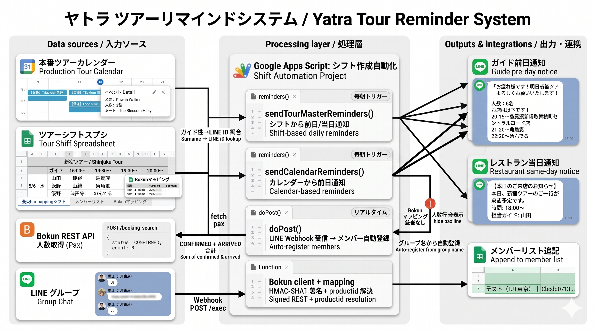

# Tour Reminder System

> ツアー会社向け、Google Apps Script 製の LINE 自動リマインドシステム

毎朝のシフトリマインドを自動化し、ガイド・レストランへの連絡を無人運用にしたプロジェクトです。

---

## システム構成図

<!-- ここにシステム構成図を貼り付ける -->
<!-- 例:  -->

_(構成図は準備中)_

---

## 概要

ツアー会社のシフト管理担当者が毎日手動で行っていた以下の業務を自動化：

- ツアー前日のガイドへの担当案内（時間 / 訪問店舗 / 人数）
- ツアー当日の店舗への来店連絡（時間 / ゲスト数 / ガイド名）
- ツアーキャンセル時の店舗への自動連絡
- 連携データ不整合時の管理者へのアラート

### 解決した課題

| Before | After |
|---|---|
| 毎朝の通知作業を担当者が手入力 | シフト編集だけで自動配信 |
| 当日の人数を予約管理画面から手で確認・転記 | API 連携で自動取得・通知に同梱 |
| キャンセル連絡漏れによるトラブル | システムが自動判定し連絡 |
| 店舗・ガイドの LINE ID をスプシに手で登録 | bot 招待 → 1 メッセージで自動登録 |

---

## 主な機能

| 機能 | 内容 |
|---|---|
| 前日ガイド通知 | 翌日担当ガイドに、ツアー時刻 / 訪問店舗 / 人数 を LINE で送信 |
| 当日レストラン通知 | 当日来店予定のレストランに、到着時刻 / ゲスト人数 / 担当ガイド を LINE で送信 |
| キャンセル自動判定 | シフトでガイド未割当 or 予約 0 件の場合、自動でキャンセル連絡 |
| 店舗ごとに通知集約 | 同じ店に複数ツアーが来る日は 1 通にまとめて送信 |
| LINE 自動登録 | bot をグループに招待 → メッセージ送信 → メンバーリストに自動追加 |
| 管理者 Slack アラート | データ不整合検知時に Slack 管理者チャンネルへ自動通知（@channel） |

---

## システム構成

### データソース

| ソース | 内容 |
|---|---|
| シフト管理スプレッドシート | ツアー名 / 時刻 / ガイド姓 / 訪問店舗 |
| 予約管理プラットフォーム | 予約人数（REST API 連携） |
| Google Calendar | カレンダー型ツアー予定（プライベート向け） |
| メンバーリストシート | 名前 ↔ LINE ID のマスタ |
| マッピングシート | ツアー × 時刻 ↔ 予約管理側の商品 ID 対応表 |

### 利用技術

| 技術 | 用途 |
|---|---|
| Google Apps Script | サーバーレス実行基盤・時間トリガー |
| Google Sheets API | シフト・マスタ読み取り |
| Google Calendar API | カレンダーイベント取得 |
| LINE Messaging API | LINE グループ・個別チャットへの通知配信 |
| 予約管理プラットフォーム REST API | HMAC-SHA1 認証で予約データ取得 |
| Slack Incoming Webhook | 管理者向けアラート |

---

## ユースケース

### UC-1: ガイドへの前日通知

毎朝の自動トリガーで、翌日担当のガイドに以下のメッセージを LINE 配信。

```
お疲れ様です！
明日 Tour A よろしくお願いいたします！
人数: 6名

お店は以下です！
18:20〜店舗 X
19:30〜店舗 Y
20:15〜店舗 Z

よろしくお願いいたします！
終了後レポートもよろしくお願いいたします！
```

複数ツアー担当時は 1 通にまとめて配信。

### UC-2: レストランへの当日通知

レストランごとに、当日同店に来訪する複数ツアーを 1 通にまとめて配信。通常通知とキャンセル通知が混在可能。

```
本日もよろしくお願い致します！

19:30-
すみません、キャンセルでお願いします。

20:30-
現在ゲスト14人＋ホスト1人の合計15人でお伺いします。
〇〇 が伺います！

21:30-
現在ゲスト3人＋ホスト1人の合計4人でお伺いします。
△△ が伺います！

よろしくお願いいたします！
```

### UC-3: 通知用 LINE 自動登録

新規ガイド / レストランとの LINE グループに bot を招待。グループ内で 1 メッセージ送信するだけで、メンバーリストに名前 / LINE ID が自動追加される。

### UC-4: マッピング不整合のアラート

シフトに記載のあるツアーが予約管理側に登録されていない場合、誤情報を送らないよう該当ツアーの通知を保留し、管理者用 Slack チャンネルに `@channel` メンション付きでアラート送信。管理者はマッピング表に該当行を追加することで、翌朝の通知から正しく配信される。

### UC-5: カレンダー起点のガイド通知

シフトに含まれない一品物のツアー（プライベートツアー等）は Google Calendar の予定をもとにガイド前日通知を行う。

---

## 運用フロー

```
[毎朝の時間トリガー]
        ↓
[シフト・予約・カレンダー読み取り]
        ↓
[人数 / キャンセル判定]
        ↓
 ┌─────┴─────┐
[LINE 配信]    [Slack アラート]
正常時            マッピング欠落時
```

### 通常運用

関係者は何もしなくてよい。異常時のみ Slack に通知 → 管理者対応。

### ツアー追加時の作業分担

| 内容 | 必要な作業 | 担当 |
|---|---|---|
| シフト人員入れ替え | シフト編集のみ | シフト管理者 |
| 新時間帯のツアー追加 | シフト編集 + マッピング表に行追加 | シフト管理者 |
| 固定店舗ツアーの店舗変更 | コード変更 | システム担当 |

---

## 既知の制限事項

- 対応シートは特定の 1 シートのみ（コード追加で複数対応可）
- LINE 配信は月 200 通まで無料、超過時は LINE 公式アカウントの有料プラン要
- 予約 API は 1 回の取得で約 5,000 件まで（ページング上限）

---

## セキュリティ

- すべての認証情報（API トークン / シークレットキー / Webhook URL）は GAS の Script Properties に格納し、コードに含めない
- スプレッドシートは Google Workspace の権限管理に準拠
- bot は招待されたグループにのみアクセス可能

---

## 設計のポイント

### 1. データ駆動設計

シフト編集 → 通知反映 をコード変更なしで実現。日次の人員交代やレストラン入れ替えはシフトスプシの編集だけで完結する。

### 2. キャンセルとデータ欠落の区別

「ガイド未割当 / 予約 0 件」と「マッピング表未登録」を内部で区別し、前者は店舗にキャンセル文言を送信、後者は誤通知を避けるため通知を保留して管理者にアラート。

### 3. ドライランモード

本番投入前の動作確認用に、Script Properties で `DRY_RUN=true` を設定すると、実際の LINE 送信を行わずログのみで挙動を確認できる。

### 4. 自動登録による運用負荷低減

メンバーリストの新規登録は LINE bot 招待 + 1 メッセージで自動完結。手動でユーザー ID を取得・転記する必要がない。

---

## ライセンス

社内ツールのため非公開。本リポジトリはシステム概要の紹介のみ。
